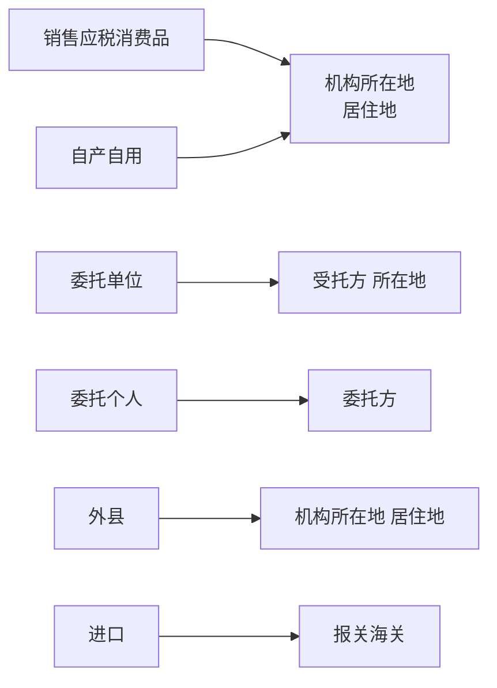

# 经济法

# 第一章
## 第1节 法律基础

法的特征
 1. 国家意志性: 国家制度认可
 2. 强制性: 强制力保证实施
 3. 规范性: 概括性，利益导向性
 4. 明确公开性和普遍约束性

法律事实
 - 按照是否以当事人的意志转移为标准划分
 1. 法律事件（人不能干的）
 2. 法律行为（人能干的）
 3. 事实行为
 - 法律关系发生，变更，消灭直接原因

法律行为分类
 1. 合法/违法
 2. 积极/消极
 3. 有偿/无偿
 4. 单方/多方
 5. 要式/非要式（要式必须有约定和法律规定）
 6. 自主/代理

法的分类
 1. 根本法/普通法（内容/效力/制定程序）
 2. 一般法/特别法（空间/时间/对人 效力）
 3. 实体法/程序法（内容）
 4. 国际法/国内法
 5. 成文法/不成文法（创制方式/表现形式）
 6. 公法/私法（运用目的）

# 第二章
# 第三章
## 第1节 支付结算概述

非现金结算工具
 三票一卡
  1. 汇票
  2. 本票
  3. 支票
  4. 银行卡
 结算方式
  1. 汇兑
  2. 托收承付
  3. 委托收款

支付结算要求
 收款人，金额，日期不得更改

伪造与变造
 1. 伪造 签章
 2. 变造 签章以外

## 第2节 银行结算账户

临时存款账户有效期不超过两年

# 第四章

## 第1节 税收法律制度概述

海关征收：关税 船舶吨税 <u> 进口环节增值 消费税 代征</u> #税收

税收法律关系主体
 1. 征税主体（各级税务机关 海关）
 2. 纳税主体（纳税人 扣缴义务人）

客体: 征税对象
内容: 权利 义务

税率形式
 1. 比例税率
 2. 定额税率
 3. 累计税率: 超额 超率 全额 不采用

## 第2节 增值税法律制度

不征增值税：公（公益事业）主（资金重组）住（城里住的的代收转账费用〔住宅维修〕）城（->存 存款利息）堡（保险赔付）

免征增值税：农民古书学避孕，盲人援助科旧物。 #增值税 

增值税税率
 1. 13% -> "有形动产"销售 加工修理修配租赁（民生9%）
 2. 9% -> 交邮建电基，土地/不动产租销
 3. 6% -> 现金电增生，无形权租销

  #增值税  #税率

增值税纳税义务发生时间
 1. 先开发票，开发票当天
 2. 视同销售，货物移送当天
 3. 直接收款，收到款或销售凭证当天
 4. 进口货物，报关进口当天
 5. 预收货款，货物发出当天
 6. 不动产 建筑/租赁服务，收到预收款当天
 7. 委托代销，收到代销清单，全部或部分货款当天，或满180天当天
 8. 赊销 分期付款，合同约定当天，无合同约定发货当天
 9. 金融商品转让，所有权转移当天
 10. 委托收款，发出货物并办妥托收手续当天

生活服务：
 1. 文化体育服务
 2. 教育医疗服务
 3. 旅游娱乐服务
 4. 餐饮住宿服务
 5. 居民日常服务
 6. 其他生活服务

<table style="text-align: center;">
    <tr>
        <td rowspan="2">包装物押金</td> 
        <td colspan="2">增值税处理</td> 
        <td colspan="2">消费税处理</td>
   </tr>
   <tr>
        <td>取得时</td> 
        <td>逾期时</td> 
        <td>取得时</td> 
        <td>逾期时</td>
   </tr>
    <tr>
        <td>一般货物</td>
  	 <td>×</td> 
        <td>✓</td> 
        <td>×</td> 
        <td>✓</td>
    </tr>
    <tr>
        <td>白酒，其他酒</td> 
        <td>✓</td> 
        <td>×</td> 
        <td>✓</td>
        <td>×</td>
    </tr>
<tr>
        <td>啤酒 黄酒</td> 
        <td>×</td> 
        <td>✓</td> 
        <td>×</td>
        <td>×</td>
   </tr>
</table>

视同销售
 1. 委托代销
 2. 代售代销
 3. 异地移送
 4. 

不得抵扣进项税
 1. 贷 餐 常 乐
 2. 非正常损失
 3. 简易计税，免征增值税，集体福利，个人消费

可以选择适用简易计税
 (理解: 不易取得进项发票的)
  1. 公共交通
  2. 动漫企业为开放动漫相关服务
  3. 电影放映，仓储，装卸搬运，收派，文化体育服务

以旧换新增值税计税
 1. 一般货物: 新货价
 2. 金银首饰: 实际收取的不含增值税全部价款

 
## 第3节 消费税法律制度

纳税地点:

定额黄啤油，复合交白卷 #消费税

将来收不到，移送时就要交 #消费税 

纳税义务发生时间: 委托提货 自产移送 进口报关 预收发出 #消费税

受托方为个人的，委托方所在地 受托方为单位的，受托方所在地 #消费税 

征收消费税
 烟、酒、高档化妆品、贵重首饰及珠宝玉石、鞭炮焰火、成品油、摩托车、小汽车、高尔夫球及球具、高档手表、游艇、木制一次性筷子、实木地板、电池、涂料  #消费税 
 >  烟酒油，车鞭球，宝石名表水中游；木筷子，木地板，电池涂料高污染 #消费税 

雪茄不是卷烟

征税环节
 - 单一环节
  1. 一般-生产，委托加工，进口
  2. 金银铂钻-零售
 - 双环节
   1. 批发阶段: 卷烟-加征 
   2. 零售阶段: 豪华小汽车-加征 #消费税 

消费税纳税义务发生时间：消费税跟物走 增值税跟钱走 [^1] #增值税 #增值税 

“换抵投”按最高销售价格征收消费税；除“换抵投”外，按平均销售价格征收消费税 #消费税 #增值税

不得扣除: 
 1. 酒摩汽表艇电涂 
 2. 跨环节 
 3. 跨税目 #消费税 

应纳税额计算
1. 先看同类
2. 如无按组成计税价格
 - 从价记证
  组成计税价格=(材料成本+加工费)÷(1﹣比例税率）
  应纳税额＝组成计税价格 x 比例税率
 - 复合计征
  组成计税价格＝(材料成本＋加工费＋委托加工数量 x 定额税率)÷(1﹣比例税率)
  应纳税额＝组成计税价格 x 比例税率＋委托加工数量 x 定额税率

## 第4节 城市维护建设税和教育费附加法

海关对进口产品代征的增值税、消费税，不征收城市维护建设税

>  进口不征，出口不退，减免的可退

城市维护建设税的税率
 差别比例税率
  1. 市区 7%
  2. 县城，镇 6%
  3. 不在市区，县城，镇 1%
 受托方代收代扣，适用受托方
 流动看经营地

应纳教育费附加=实际缴纳增值税、消费税税额之和×征收比率

## 第5节车辆购置税法律制度

征收范围: 
 1. 汽车
 2. 有轨电
 3. 汽车挂车
 4. 排气量超过150ml的摩托车
> 魔鬼汽车（摩托、有轨电车、汽车、挂车）

只要没“自用”，就不缴纳车辆购置税。

## 第6节 关税法律制度

应缴纳进口增值税=（关税完税价格+关税）
关税完税价格=买价+其他杂费
出口货物应当以海关审定的货物售予境外的离岸价格，扣除出口关税后作为关税完税价格。

关税的税率
 1. 最惠国：出现最惠国 
 2. 协定：出现签订
 3. 特惠：出现特别
 4. 关税配额：内低外高 
 5. 暂定：最惠国税率基础上，国际双边关系 
 6. 普通税率:未与我国～及原产地不明

对从境外采购进口的原产于中国境内的货物，按照最惠国税率征税。

相关税费
 1. 关税=关税完税价×关税税率 
 2. 进口消费税=（关税完税价格+关税)÷(1－消费税率)×消费税率 
 3. 进口增值税=（关税完税价+关税+消费税）×增值税率 
 4. 城建教育费附加进口不征出口不退

起卸前要计入成本 起卸后不计入成本

免征关税
 - 法定免税（无经营性质的东西）
  1. 关税税额在人民币50元以下的一票货物；
  2. 无商业价值的广告品和货样；
  3. 外国政府、国际组织无偿赠送的物资；
  4. 在海关放行前损失的货物；
  5. 进出境运输工具装载的途中必需的燃料、物料和饮食用品。
  6. 因故退还的中国出口货物/境外进口货物，免出口已证进口不退
 - 政策性减免税（酌情减免，有损失损坏的东西）
  1. 境外运输途中/起卸时，损失损坏的
  2. 起卸后方行前，不可抗力的
  3. 查验时已坏，不是保管不善造成

关税从量计征：啤酒 原油。 
复合计征：广播用录像机 放像机 摄像机。

关税应纳税额的计算方法： 
 1. 从价税计算法 
 2. 从量税计算法
 3. 复合税计算法 
 4. 滑准税计算法（价高税低，税低价高）（反比）

# 第五章
# 第七章
违法行为
 

## 第1节 企业所得税法律制度

固定资产计税基础 
 1. 外购：买价、税费、其他费用 
 2. 自建：竣工结算前发生的支出
 3. 融资租入：合同约定的付款总额（或公允价值）、相关费用 
 4. 盘盈：重置完全成本 
 5. 改建：以改建支出增加计税基础 
 6. 其他方式：公允价值、税费 #固定资产 #企业所得税

不交企业所得税
 1. 个体工商户
 2. 个人独资
 3. 合伙企业
 （两人一伙）

不得税前扣除
 1. 罚金、罚款不能扣，罚息可以扣； 
 2. 赞助支出不能扣，广告支出可以扣； 
 3. 坏账准备不能扣，坏账损失可以扣； 
 4. 企业所得税、增值税不能扣，其他税可以扣； 
 5. 行政、刑事责任不得扣除，民事责任可以扣；

确认收入实现时间: 
 1. 捐赠看实际；
 2. 利息租金看合同；
 3. 股息红利看分配 #企业所得税 

应纳税额＝应纳税所得额 × 适用税率－减免税额－抵免税额 #企业所得税 

加计扣除：
 1. 一般企业（研发费用75%，形成无形资产的175%）；
 2. 制造业企业（研发费用100%，形成无形资产的200%） #企业所得税 

税率
 1. 工会经费2% 
 2. 职工教育经费8%
 3. 福利费14% 
 4. 业务招待费按实际发生额的60%和年收入的5‰(0.005)，较按低的扣除 
 5. 广告费收入的15% 
 6. 化医饮年收入的30% 
 7. 捐赠公益利润总额12% 
 8. 贫困捐赠据实扣 
 9. 利息按同期利率扣 
 10. 手续费保险18% 
 11. 其他合同5%  #税率 #企业所得税 

纳税地点
 1. 销售货物 提供劳务——发生地 
 2. 不动产转让——不动产所在地 
 3. 动产转让——转让动产的企业机构所在地 
 4. 权益性投资资产的转让（股票）——被投资企业所在地 股息，
 5. 红利所得——分配所得的企业所在地 
 6. 利息，租金，特许权使用费所得——负担支配所得的企业所在地 #企业所得税 

收入的确认: 
 1. 预收-发货。
 2. 托收-办手续。
 3. 委托-收清单。
 4. 安装-安完。
 5. 简单-发货 #企业所得税 

纳税时间： 
 1. 纳税年度:1月1到12月31 
 2. 年度终了:5个月内汇算清缴 
 3. 月度终了:15日内预缴 
 4. 终营:60天汇算清缴 #企业所得税 

创投企业投资未上市的中小高新技术企业或种子期、初创期科技型企业两年以上的，按照其投资额的70%，在股权持有满两年的当年抵扣该创业投资企业的应纳税所得额
(满2投7)

税收优惠
 1. 应纳税额抵免→三个设备（节能环保安全投资额10%) 
 2. 加计扣除→2类研发（加计175%）残工资（100%）高新企业研发费用化的发生额100％扣除
 3. 应纳税所得额抵减
  - 投资高新企业满2年按投资额的x70%扣除
  - 专门研发设备全额扣除

1. 电子设备，畜类生产性生物资产 3年
2. 飞机/火车/轮船以外的运输工具 4年
3. 器具/家具/工具 5年
4. 飞机火车轮船，机器机械和其他生产设备 10年，林木类生成性生物资产 10年
5. 房屋/建筑物 20年

# 第八章 
## 第1节 劳动合同法律制度

带薪年休假
 1. 1-10y 5d  病假>2m 不享受
 2. 10-20y 10d  病假>3m 不享受
 3. 20y+ 15  病假>4m 不享受

准工时8小时，普通工作日加班150%，周末加班200%，节假日加班300%

劳动仲裁时效
 1. 知道/应当知道起 1年
 2. 劳动关系存续 ∞年
 3. 劳动关系终止 1年
 4. 客观原因中止 重新算
 5. 主观原因中断 重新算

非全日制用工
 1. 可订立口头协议；
 2. 可与多家订立但后订立不能影响先订立；
 3. 不得约定试用期；
 4. 不得低于当地最低小时工资标准；
 5. 报酬结算周期不得超过15日。

## 第2节 社会保险法律制度 

工伤医疗期:  
 1. <10y   <5y 3m  5y<x<10y 6m
 2. >=10y   <5y 6m <10y 9m <15y 12m <20y 18m >=20y 24m #社会保险 #医疗保险 

病假工资可以低于当地最低工资标准支付，但不得低于当地最低工资标准的80%。 #医疗保险 

欺诈伪造250（处骗取金额2倍以上5倍以下的罚款），逾期不交装13（欠缴数额1倍以上3倍以下的罚款）

视同工伤: #社会保险 #工伤保险
 1. 48小时内死亡 
 2. 抢险救灾 
 3. 旧病复发 

## 补充

> [1]（1）纳税人销售应税消费品的，按不同的销售结算方式确定，分别为：
> 1. 采用赊销和分期收款结算方式的，为书面合同约定的收款日期的当天，书面合同没有约定收款日期或者无书面合同的，为发出应税消费品的当天。
> 2. 采用预收货款结算方式的，为发出应税消费品的当天。
> 3. 采取托收承付和委托银行收款方式的，为发出应税消费品并办妥托收手续的当天。
> 
> （2）
> 1. 采取其他结算方式的，为收讫销售款或者取得索取销售款凭据的当天。
> 2. 纳税人自产自用应税消费品的，为移送使用的当天。
> 3. 纳税人委托加工应税消费品的，为纳税人提货的当天。
> 4. 纳税人进口应税消费品的，为报关进口的当天。
