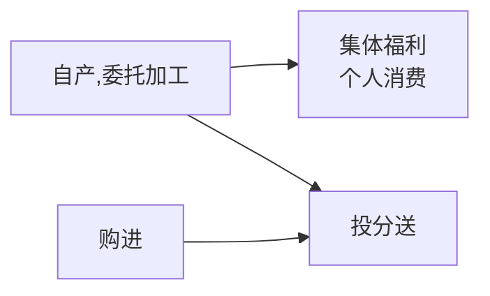

# 经济法

# 第一章
# 第二章
# 第三章
# 第四章

## 第1节 税收法律制度概述

海关征收：关税 船舶吨税 <u> 进口环节增值 消费税 代征</u> #税收

税收法律关系主体
1. 征税主体（各级税务机关 海关）
2. 纳税主体（纳税人 扣缴义务人）

客体: 征税对象
内容: 权利 义务

税率形式
1. 比例税率
2. 定额税率
3. 累计税率: 超额 超率 ~~全额 不采用~~

## 第2节 增值税法律制度
不征增值税：公（公益事业）主（资金重组）住（城里住的的代收转账费用〔住宅维修〕）城（->存 存款利息）堡（保险赔付）

免征增值税：农民古书学避孕，盲人援助科旧物。 #增值税 

增值税税率
1. 13% -> "有形动产"销售 加工修理修配租赁（民生9%）
2. 9% -> 交邮建电基，土地/不动产租销
3. 6% -> 现金电增生，无形权租销

 #增值税  #税率

增值税纳税义务发生时间
1. 先开发票，==开发票==当天
2. 视同销售，货物==移送==当天
3. 直接收款，==收到款或销售凭证==当天
4. 进口货物，==报关进口==当天
5. 预收货款，==货物发出==当天
6. 不动产 建筑/租赁服务，==收到预收款==当天
7. 委托代销，收到==代销清单==，==全部或部分货款==当天，或==满180天==当天
8. 赊销 分期付款，==合同约定==当天，无合同约定==发货==当天
9. 金融商品转让，==所有权转移==当天
10. 委托收款，==发出货物并办妥托收手续==当天

生活服务：
1. 文化体育服务
2. 教育医疗服务
3. 旅游娱乐服务
4. 餐饮住宿服务
5. 居民日常服务
6. 其他生活服务

<table style="text-align: center;">
    <tr>
        <td rowspan="2">包装物押金</td> 
        <td colspan="2">增值税处理</td> 
        <td colspan="2">消费税处理</td>
   </tr>
   <tr>
        <td>取得时</td> 
        <td>逾期时</td> 
        <td>取得时</td> 
        <td>逾期时</td>
   </tr>
    <tr>
        <td>一般货物</td>
  	 <td>×</td> 
        <td>✓</td> 
        <td>×</td> 
        <td>✓</td>
    </tr>
    <tr>
        <td>白酒，其他酒</td> 
        <td>✓</td> 
        <td>×</td> 
        <td>✓</td>
        <td>×</td>
    </tr>
<tr>
        <td>啤酒 黄酒</td> 
        <td>×</td> 
        <td>✓</td> 
        <td>×</td>
        <td>×</td>
   </tr>
</table>

视同销售
1. 委托代销
2. 代售代销
3. 异地移送
4. 

不得抵扣进项税
1. 贷 餐 常 乐
2. 非正常损失
3. 简易计税，免征增值税，集体福利，个人消费

 
## 第3节 消费税法律制度

定额黄啤油，复合交白卷 #消费税

将来收不到，移送时就要交 #消费税 

纳税义务发生时间: 委托提货 自产移送 进口报关 预收发出 #消费税

受托方为个人的，委托方所在地 受托方为单位的，受托方所在地 #消费税 

烟、酒、高档化妆品、贵重首饰及珠宝玉石、鞭炮焰火、成品油、摩托车、小汽车、高尔夫球及球具、高档手表、游艇、木制一次性筷子、实木地板、电池、涂料  #消费税 
>  烟酒油，车鞭球，宝石名表水中游；木筷子，木地板，电池涂料高污染 #消费税 

雪茄不是卷烟

批发阶段: 卷烟-加征 
 零售阶段: 金银铂钻 豪华小汽车-加征 #消费税 

消费税纳税义务发生时间：消费税跟物走 增值税跟钱走 [^1] #增值税 #增值税 

“换抵投”按最高销售价格征收消费税；选除“换抵投”外，按平均销售价格征收消费税 #消费税 #增值税

不得抵扣: 1.酒摩车表艇电涂 2.不得跨环节 3.不得跨税目 #消费税 

# 第五章
## 第1节 企业所得税法律制度

固定资产计税基础 
1. 外购：买价、税费、其他费用 
2. 自建：竣工结算前发生的支出
3. 融资租入：合同约定的付款总额（或公允价值）、相关费用 
4. 盘盈：重置完全成本 
5. 改建：以改建支出增加计税基础 
6. 其他方式：公允价值、税费 #固定资产 #企业所得税

确认收入实现时间: 
1. 捐赠看实际；
2. 利息租金看合同；
3. 股息红利看分配 #企业所得税 

应纳税额＝应纳税所得额 × 适用税率－减免税额－抵免税额 #企业所得税 

加计扣除：
1. 一般企业（研发费用75%，形成无形资产的175%）；
2. 制造业企业（研发费用100%，形成无形资产的200%） #企业所得税 

税率
1. 工会经费2% 
2. 职工教育经费8%
3. 福利费14% 
4. 业务招待费按实际发生额的60%和年收入的千分之五比较按低的扣除 
5. 广告费收入的15% 
6. 化医饮年收入的30% 
7. 捐赠公益利润总额12% 
8. 贫困捐赠据实扣 
9. 利息按同期利率扣 
10. 手续费保险18% 
11. 其他合同\*5%  #税率 #企业所得税 

销售货物 提供劳务——发生地 
不动产转让——不动产所在地 
动产转让——转让动产的企业机构所在地 
权益性投资资产的转让（股票）——被投资企业所在地 股息，
红利所得——分配所得的企业所在地 
利息，租金，特许权使用费所得——负担支配所得的企业所在地 #企业所得税 

收入的确认: 预收-发货。托收-办手续。委托-收清单。安装-按完，简单-发货 #企业所得税 

纳税时间： 
1. 纳税年度:1月1到12月31 
2. 年度终了:5个月内汇算清缴 
3. 月度终了:15日内预缴 
4. 终营:60天汇算清缴 #企业所得税 

# 第八章 
## 第1节 劳动合同法律制度

带薪年休假
1. 1-10y 5d  病假>2m 不享受
2. 10-20y 10d  病假>3m 不享受
3. 20y+ 15  病假>4m 不享受

准工时8小时，普通工作日加班150%，周末加班200%，节假日加班300%

劳动仲裁时效
1. 知道/应当知道起 1年
2. 劳动关系存续 ∞年
3. 劳动关系终止 1年
4. 客观原因中止 重新算
5. 主观原因中断 重新算

非全日制用工
1. 可订立口头协议；
2. 可与多家订立但后订立不能影响先订立；
3. 不得约定试用期；
4. 不得低于当地最低小时工资标准；
5. 报酬结算周期不得超过15日。

## 第2节 社会保险法律制度 

工伤医疗期:  
1. <10y   <5y 3m  5y<x<10y 6m
2.  >=10y   <5y 6m <10y 9m <15y 12m <20y 18m >=20y 24m #社会保险 #医疗保险 

病假工资可以低于当地最低工资标准支付，但不得低于当地最低工资标准的80%。 #医疗保险 

欺诈伪造250（处骗取金额2倍以上5倍以下的罚款），逾期不交装13（欠缴数额1倍以上3倍以下的罚款）

视同工伤: #社会保险 #工伤保险
1. 48小时内死亡 
2. 抢险救灾 
3. 旧病复发 

## 补充

> [1] 1.纳税人销售应税消费品的，按不同的销售结算方式确定，分别为：
> （1）采用赊销和分期收款结算方式的，为书面合同约定的收款日期的当天，书面合同没有约定收款日期或者无书面合同的，为发出应税消费品的当天。
> （2）采用预收货款结算方式的，为发出应税消费品的当天。
> （3）采取托收承付和委托银行收款方式的，为发出应税消费品并办妥托收手续的当天。
> （4）采取其他结算方式的，为收讫销售款或者取得索取销售款凭据的当天。
> 2.纳税人自产自用应税消费品的，为移送使用的当天。
> 3.纳税人委托加工应税消费品的，为纳税人提货的当天。
> 4.纳税人进口应税消费品的，为报关进口的当天。